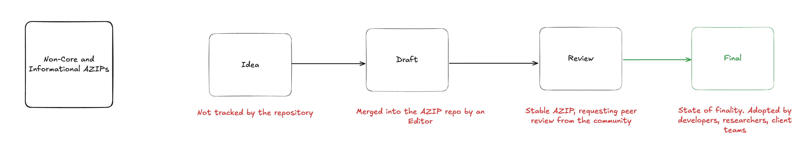
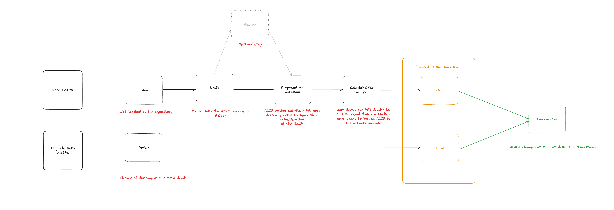

## What is an AZIP?
AZIP stands for Aztec Improvement Proposal. An AZIP is a design document providing information to the Aztec community, or describing a new feature for Aztec or its processes or environment. 

AZIPs are tracked in a dedicated GitHub repository and are considered the source of truth for protocol features and standards. When relevant, an AZIP should provide a concise technical specification of the feature and a rationale for the feature. The AZIP author is responsible for building consensus within the community and documenting dissenting opinions.

## AZIP Rationale

We intend AZIPs to be the primary mechanisms for proposing new features, for collecting community technical input on an issue, and for documenting the design decisions that have gone into Aztec. Because the AZIPs are maintained as text files in a versioned repository, their revision history is the historical record of the feature proposal.

For Aztec implementers, AZIPs are a convenient way to track the progress of their implementation. Ideally each implementation maintainer will list the AZIPs that they have implemented. This will give end users a convenient way to know the current status of a given implementation or library.

We lean heavily on copying how Ethereum manages its AZIPs, but instead adopt the name of AZIPs, or AZtec Improvement Proposals.

## AZIP Types

There are five types of AZIPs:

1.  A **Core AZIP** describes any change that results in a new Aztec rollup smart contract being deployed to the L1. Examples include AZIPs that change protocol circuits resulting in new `vks`, and thus requiring changing the verifier on L1. Generally, Core AZIPs: 

    * Require a governance upgrade that results in the deployment of a new rollup smart contract on Ethereum. 
    * Require a supermajority of clients to implement them. 

    Core AZIPs become `Final` by being included in Meta AZIPs that pass a governance proposal. 

2. A **Non-Core AZIP** describes changes that do not result in a new rollup smart contract being deployed to the L1. Examples include changes to client implementations of the P2P networking layer, or changes to mutable parameters on the L1 contracts.

    Since not all non-Core AZIPs require a governance vote, such AZIPs become `Final` in various ways including 

3. **AZRCs** describe standards and application layer interfaces. AZRCs become `Final` through adoption and usage by the community of devs, users and researchers. Examples include token standards, wallet formats etc. 

4. **Informational AZIPs** describes general guidelines or information to the Aztec community, but does not propose a new feature. Users of the Aztec Network, and client teams are free to ignore Informational AZIPs or follow their advice. 

5. **Meta AZIPs** describes a network upgrade. In the Aztec Network, network upgrades refer to governance proposals which deploy one more new governance contracts on the L1. This is the equivalent of an Aztec "hard fork". Each network upgrade is associated with a single Meta AZIP.  

Meta AZIPs need to include references to one Core AZIPs at a minimum. non-Core AZIPs that have been included in a network upgrade are not required to be included in the Meta AZIP. Meta AZIPs become `Final` when they are implemented on a testnet. 

## AZIP Workflow

There are three actors involved: The AZIP author, the AZIP editors, and the Aztec Core Devs. 

Every non-Meta AZIP starts with the AZIP author drafting a [forum](#https://forum.aztec.network/) post to pre-vet their idea. There is an expectation that AZIPs that require a lot of work to implement must receive more scrutiny and positive feedback from the community before moving on to the next step. 

Once the AZIP author is comfortable with the feedback and community support behind their AZIP, they may draft a formal `Draft` status AZIP and submit a PR to add it to the AZIP repository. AZIP editors are responsible for checking AZIP PRs for basic grammar and completeness before merging them. AZIP editors do not impart any subjective judgement on likelihood of an AZIP to be passed: if the AZIP is complete, is technically feasible and drafted according to best practices described in this AZIP#1, then the PR should be merged. 

### Core AZIPs

For Core AZIPs, given they require inclusion in a Meta AZIP to be considered `Final`, the AZIP author will need to obtain buy-in from the Aztec Core Contributors to get the AZIP included in a Meta AZIP. 

## AZIP Process

### Informational, AZRCs and Non-Core AZIPs

These AZIPs progress from Idea -> Draft -> Review -> Final.

**Idea Stage**: AZIPs in the `Idea` stage are not tracked within the repository. They are instead posted by the author on public forums, including the Aztec [forum](#https://forum.aztec.network/).

**Draft Stage**: After feedback from the community, the AZIP author can submit a PR to the AZIP repository. An AZIP editor checks for basic correctness, technical soundness and grammar. All AZIPs which are merged to the repo begin with a `Draft` status. 

**Review Stage**: An AZIP author can submit another PR to mark an AZIP as "stable" and requesting peer review from the community. AZIPs that make it to `Review` have typically achieved consensus within the community and are expected to become `Final` at some point. 

**Final Stage**: An AZIP becomes `Final` to indicate a state of finality. Only non-normative changes, or changes to correct errata, are allowed to change `Final` PR. Non-normative additions include explanations, providing examples or adding notes to help readers understand the AZIP without altering the actual requirements. 

### Core and Meta AZIPs

Core AZIPs must be included in a scheduled network upgrade on a Testnet to achieve `Final` status. When the network upgrade is successful on Aztec Mainnet, the Core AZIP along with the Meta AZIP become `Implemented`. For Core AZIPs, the `Review` stage is optional. 

While anyone can create and submit a PR to add non-Meta AZIPs to the repository, only the Aztec Core Contributors can start Meta AZIPs. Core Contributors are responsible for maintaining the Meta AZIPs and by extension responsible for advancing the Core AZIPs from `Draft` to `Implemented`, according to the following process.

1. Core AZIPs undergo the same `Idea` -> `Draft` phase as Non-Core AZIPs
2. Anyone may open a PR to add a `Draft` AZIP to the `Proposed for Inclusion` section of the Meta AZIP. 
3. Core Contributors, at the Core Contributors call, agree to merge the PR into the `Proposed for Inclusion` section of a specific Meta AZIP to indicate they are considering including this AZIP in the upgrade. 
4. At any time during the network upgrade planning process, Core Contributors may move AZIPs from any other stage to the `Declined for Inclusion` stage if they are against including the AZIP in the network upgrade.
    * AZIP authors may reintroduce a `Declined for Inclusion` AZIP back as a `Proposed for Inclusion` for future Meta AZIPs.
5. When Core Contributors agree to implement and test an AZIP, it should be moved to `Scheduled for Inclusion`.
    * Once moved to `Scheduled for Inclusion` an AZIP should be included in the network upgrade if no issues arise. 
    * An AZIP may be moved from `Scheduled for Inclusion` to `Declined for Inclusion` if Core Contributors are against including it in the network upgrade.

Every Meta AZIP should provide the Public Testnet and Devnet entries for the table below. Meta AZIPs stay at `Review` until the network upgrade is successful on Testnet after which Core Contributors should change status to `Final`. The status of all Core AZIPs included in the network upgrade also become `Final` at this point. 

 At the following Core Contributors call, an activation slot and activation timestamp for Mainnet is decided and the Meta AZIP updated. 

| Network Name     | Activation Slot | Activation Timestamp |
|------------------|------------------|----------------------|
| Public Testnet   |                  |                      |
| Devnet           |                  |                      |
| Mainnnet         |                  |                      |

>Note: It is recommended that at least one AZIP editor regularly join the Core Contributor call to facilitate this process. 

### Living Status

Similar to Ethereum, we add a special status tag `Living` for AZIPs that are expected to be continually updated and not reach a state of finality. 

### Governance Proposal

Once an activation slot and timestamp have been decided on, Aztec stakeholders should initiate a governance proposal and choose a Round which ends right before the Activation Slot.  

Upon a successful governance proposal, the Meta AZIP status is changed to `Implemented`.

## What belongs in a successful AZIP?

Each AZIP should have the following parts:

* **Preamble** - Headers containing metadata about the AZIP, including the AZIP number, a short descriptive title (limited to a maximum of 44 characters), a description (limited to a maximum of 140 characters), and the author details. Irrespective of the type, the title and description should not include AZIP number. See below for details.
* **Abstract** - Abstract is a multi-sentence (short paragraph) technical summary. This should be a very terse and human-readable version of the specification section. Someone should be able to read only the abstract to get the gist of what this specification does.
* **Motivation** (optional) - A motivation section is critical for Core AZIPs that want to change the protocol. It should clearly explain why the existing protocol specification is inadequate to address the problem that the AZIP solves. This section may be omitted if the motivation is evident.
* **Specification** (required for Core AZIPs) - The technical specification should describe the syntax and semantics of any new feature. The specification should be detailed enough to allow competing, interoperable implementations.
* **Rationale** - The rationale fleshes out the specification by describing what motivated the design and why particular design decisions were made. It should describe alternate designs that were considered and related work, e.g. how the feature is supported in other languages. The rationale should discuss important objections or concerns raised during discussion around the AZIP.
* **Backwards Compatibility** (optional) - All AZIPs that introduce backwards incompatibilities must include a section describing these incompatibilities and their consequences. The AZIP must explain how the author proposes to deal with these incompatibilities. This section may be omitted if the proposal does not introduce any backwards incompatibilities, but this section must be included if backward incompatibilities exist.
* **Test Cases** (optional) - Tests should either be inlined in the AZIP as data, such as input/expected output pairs, or included in `../assets/azip-###/<filename>`.
Reference Implementation (optional) - An optional section that contains a reference/example implementation that people can use to assist in understanding or implementing this specification. This section may be omitted for all AZIPs.
* **Security Considerations** All AZIPs must contain a section that discusses the security implications/considerations relevant to the proposed change. Include information that might be important for security discussions, surfaces risks and can be used throughout the life-cycle of the proposal. E.g. include security-relevant design decisions, concerns, important discussions, implementation-specific guidance and pitfalls, an outline of threats and risks and how they are being addressed.

    AZIP submissions missing the "Security Considerations" section will be rejected. An AZIP cannot proceed to status "Final" without a Security Considerations discussion deemed sufficient by the reviewers.

* **Copyright Waiver** - All AZIPs must be in the public domain. The copyright waiver MUST link to the license file and use the following wording: `Copyright and related rights waived via [CC0](/LICENSE)`.

## AZIP Header Preamble

Each AZIP must begin with a header preamble. The headers must appear in the following order.

| Field            | Value                                                                                          |
|------------------|------------------------------------------------------------------------------------------------|
| azip             | AZIP number (this is determined by the AZIP Editor when it is accepted as a Draft).          |
| title            | The AZIP title is a few words, not a complete sentence.                                      |
| description      | Description is one full (short) sentence.                                                    |
| author           | Comma separated list of the authors. Example: FirstName LastName (@GitHubUsername), FirstName LastName <foo@bar.com> |
| discussions-to   | The URL pointing to the official discussion thread in the Aztec forum.                       |
| status           | Draft, Review, Final, or Cancelled                                                            |
| type         | Informational, AZRC, Non-Core, Core or Meta                                                             |
| created          | Date created on, in ISO 8601 (yyyy-mm-dd) format.                                           |
| requires         | AZIP number(s) (Optional)

### `author` header
The `author` header lists the names, email addresses or usernames of the authors/owners of the AZIP. Those who prefer anonymity may use a username only, or a first name and a username. The format of the `author` header value must be:

> Random J. User &lt;address@dom.ain&gt;

or

> Random J. User (@username)

or

> Random J. User (@username) &lt;address@dom.ain&gt;

if the email address or GitHub username is included, and

> Random J. User

if neither the email address nor the Github username are given.

At least one author must use a GitHub username, in order to get notified on change requests and have the capability to approve or reject them.

### `discussions-to` header
While an AZIP is a draft, a `discussions-to` header will indicate the URL where the AZIP is being discussed (in the Aztec forum).

## AZIP Formats and Templates

All AZIPs should be written in markdown format. An AZIP template can be found [here](#https://127.0.0.1). A template for Meta AZIPs can be found [here](./../meta-azip-template.md).

## Linking to other AZIPs

References to other AZIPs should follow the format AZIP-N where N is the AZIP number you are referring to. Each AZIP that is referenced in an AZIP MUST be accompanied by a relative markdown link the first time it is referenced, and MAY be accompanied by a link on subsequent references. The link MUST always be done via relative paths so that the links work in the GitHub repository, forks of this repository, the main AZIPs site, mirrors of the main AZIP site, etc.

## Linking to External Resources

Links to external resources **SHOULD NOT** be included. External resources may disappear, move, or change unexpectedly.

## Auxiliary Files

Images, diagrams and auxiliary files should be included in a subdirectory of the assets folder for that AZIP as follows: `assets/azip-N` (where N is to be replaced with the AZIP number). When linking to an image in the AZIP, use relative links such as `../assets/azip-1/image.png.`

## AZIP Editors

The current AZIP editors are: 

* Amin Sammara (@aminsammara)
* Charlie Lye (@charlielye)
* Joe Andrews (@joeandrews)
* Josh Crites (@critesjosh)
* Michael Connor (@iAmMichaelConnor)
* Rahul Kothari (@rahul-kothari)
* Savio Sou (@Savio-Sou)

### AZIP Editor Responsibilities

For each new AZIP that comes in, an editor does the following:

* Read the AZIP to check if it is ready: sound and complete. The ideas must make technical sense, even if they don't seem likely to get to final status.
* The title should accurately describe the content.
* Check the AZIP for language (spelling, grammar, sentence structure, etc.), markup (GitHub flavored Markdown), code style.

If the AZIP isn't ready, the editor will send it back to the author for revision, with specific instructions.

Once the AZIP is ready for the repository, the AZIP editor will:

* Assign an AZIP number (generally the PR number, but the decision is with the editors)
* Merge the corresponding pull request
* Send a message back to the AZIP author with the next step.
* Many AZIPs are written and maintained by developers with write access to the Aztec codebase. The AZIP editors monitor AZIP changes, and correct any structure, grammar, spelling, or markup mistakes we see.

In addition, at least one AZIP editor should regularly join the Aztec Core Contributors call to assist with changing status of Core and Meta AZIPs.

## History

This document was derived heavily from Ethereum's [AZIP-001](#https://AZIPs.ethereum.org/AZIPS/AZIP-1), which in turn was derived from Bitcoin's [BIP-0001](#https://github.com/bitcoin/bips) written by Amir Taaki which in turn was derived from Python's [PEP-0001](#https://peps.python.org/). The process for organizing network upgrades was derived heavily from Ethereum's [AZIP-7723] written by Tim Beiko. 

In many places text was simply copied and modified. Do not bother the authors of these ancestor works with technical questions specific to Aztec or the AZIP. Please direct all comments to the AZIP editors.